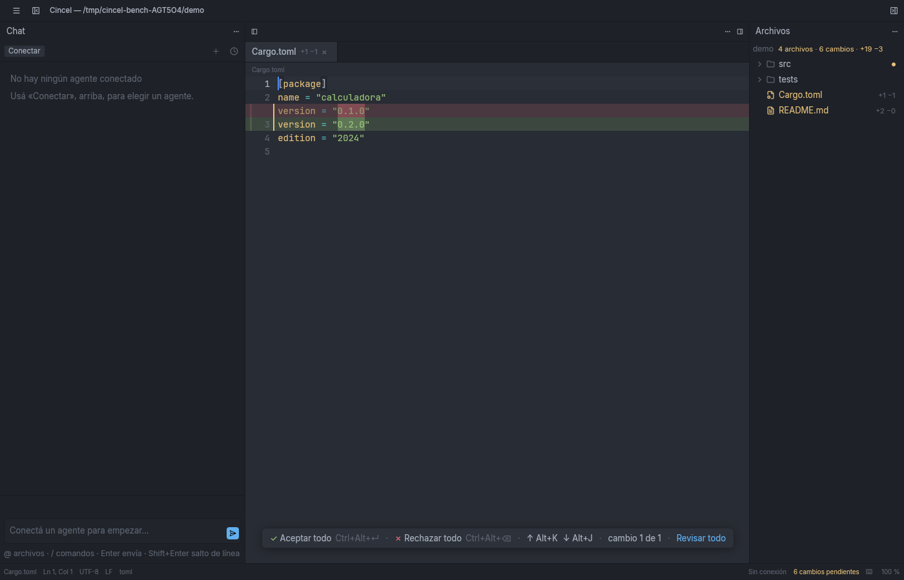
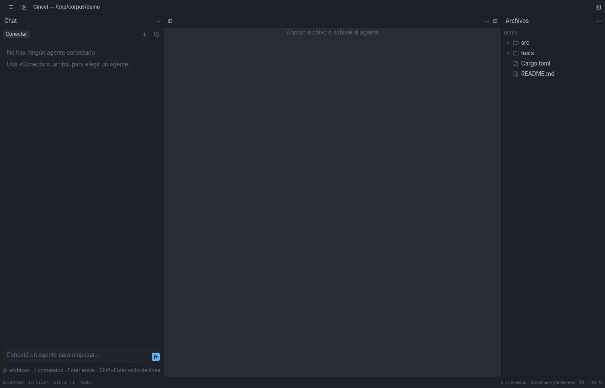
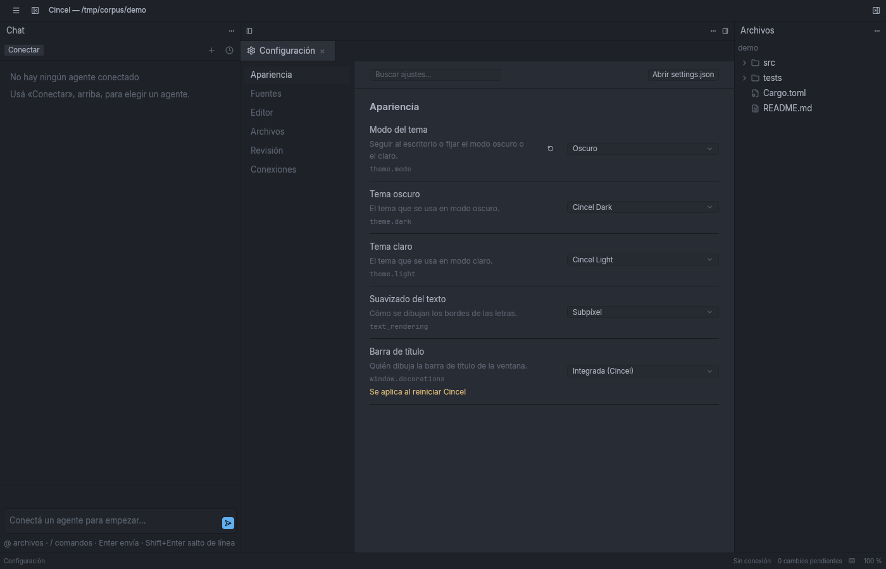
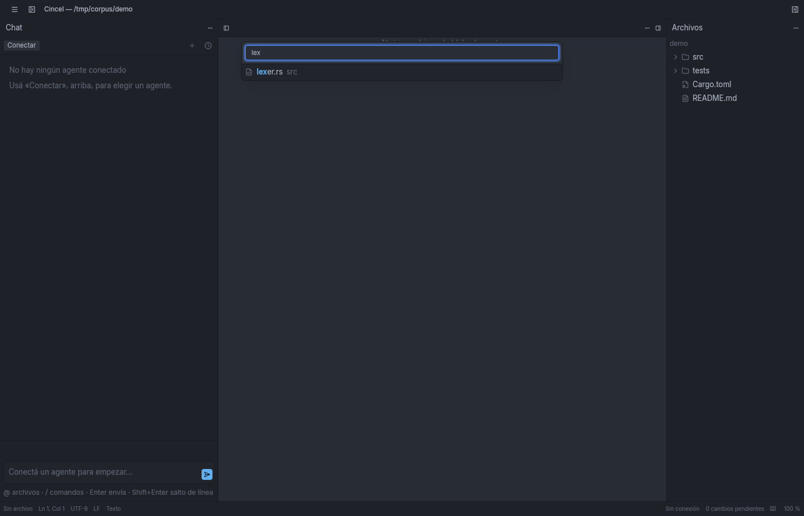

# Cincel

Cincel is a minimalist code editor for Linux, written in Rust on Zed's
graphics engine (GPUI), with an integrated chat panel for coding agents
(Claude Code, Codex, Google Antigravity, OpenCode, and any
[ACP](https://agentclientprotocol.com)-compatible agent) using your own
subscriptions.



**What sets it apart:** every change an agent makes shows up inside the
editor, segment by segment, and you accept or reject each segment or each
line. You never review changes in the chat.

## Features

Besides editing and chatting with agents:
- Fast file finder (`Ctrl+P`), fuzzy and typo-tolerant.
- Settings screen (`Ctrl+,`) with toggles and pickers for what today
  you'd edit by hand in `settings.json`, including connection management.
- Keyboard shortcuts modal with search (`F1`).
- Git status in the editor gutter: what changed since the last commit,
  without hiding the agent's own change markers.
- Find and replace in the file (`Ctrl+H`), including inside lines the
  agent removed.
- Optional autosave, on focus loss or after a pause in typing.





## Installation

Download the latest release from the [Releases
page](https://github.com/jotagary25/cincel/releases) (the author replaces
`jotagary25` once the repository is public — `docs/publicacion.md`).

### Tarball

```sh
tar -xzf cincel-0.1.0-x86_64-linux.tar.gz
cd cincel-0.1.0-x86_64-linux
./install.sh
```

Installs into `$HOME/.local` (no `sudo`) and adds Cincel to your
application launcher. Uninstall with `./install.sh --uninstall` (this
keeps your settings, connections and pending reviews).

### `.deb` (Ubuntu / Pop!\_OS 22.04+)

```sh
sudo apt install ./cincel_0.1.0-1_amd64.deb
```

Or double-click the file in a graphical file manager.

## First run

Open a folder from the launcher, with `Ctrl+O`, or from the command line
(`cincel <path>`). The window has three areas: the file tree, the editor,
and the chat panel — connect an agent from the chat panel to start a
session. The full walk-through (in Spanish) is in
[`docs/usuario/primer-arranque.md`](docs/usuario/primer-arranque.md).

## Requirements

- Linux with Wayland or X11; a GPU with Vulkan or OpenGL.
- To build from source: stable Rust (installed by `rustup` per
  `rust-toolchain.toml`) and the `libxkbcommon-x11-dev` package
  (Debian/Ubuntu).
- A Claude, ChatGPT (Codex) or Google (Antigravity) subscription. Cincel
  downloads the official agents and the runtime they need on its own,
  into its own folder; you don't need Node or the CLIs installed, nor
  sessions already open on the system.

## Build from source

```sh
cargo build --release -p cincel
target/release/cincel --version
```

See [`CONTRIBUTING.md`](CONTRIBUTING.md) for the full development setup
(the fixed test-feature set, the verification commands CI runs) and
[`packaging/README.md`](packaging/README.md) for building the
distributable tarball and `.deb` yourself.

## Documentation

- [`docs/usuario/`](docs/usuario/): the user manual, in Spanish
  (installation, first run, connecting agents, reviewing changes,
  shortcuts, settings, troubleshooting).
- [`docs/rendimiento.md`](docs/rendimiento.md): measured performance,
  compared against Zed and Antigravity IDE.
- [`docs/guia-integracion-acp.md`](docs/guia-integracion-acp.md): how
  Cincel talks to an ACP agent, for anyone integrating a new one.
- [`docs/publicacion.md`](docs/publicacion.md): the author's own guide to
  publish a release (creating the repository, the version tag, the
  packages) — not needed to use or build Cincel.
- [`docs/00-sintesis-y-decisiones.md`](docs/00-sintesis-y-decisiones.md):
  why it's built this way.
- [`docs/specs/`](docs/specs/): what it does, how it looks, how it's
  built, and the stage-by-stage plan.
- [`docs/research/`](docs/research/): the prior research (ACP, Rust
  frameworks, change-review UX, Zed's own internals).

## License

MIT — see [`LICENSE`](LICENSE). Cincel embeds the Inter and JetBrains Mono
fonts under the SIL Open Font License 1.1
(`crates/cincel-workspace/assets/fonts/`); third-party dependency licenses
are listed in `THIRD-PARTY-LICENSES.html`, generated at release time and
included in both packages.

---

## En español

Cincel es un editor de código minimalista para Linux, escrito en Rust con
el motor gráfico de Zed (GPUI), con chat integrado para agentes de
programación (Claude Code, Codex, Google Antigravity, OpenCode y
cualquier agente compatible con [ACP](https://agentclientprotocol.com))
usando tus propias suscripciones.

Lo que lo distingue: **cada cambio que hace un agente se muestra dentro
del editor, segmento por segmento, y vos aceptás o rechazás cada segmento
o cada línea.** Nunca revisás cambios en el chat.

- **Instalar**: el comprimido (`tar.gz` + `./install.sh`, sin `sudo`) o el
  paquete `.deb` (`sudo apt install ./cincel_0.1.0-1_amd64.deb`, o doble
  clic) — comandos exactos más arriba, en "Installation".
- **Manual completo, en español**: [`docs/usuario/`](docs/usuario/) —
  instalación, primer arranque, conectar agentes, revisar cambios,
  atajos, ajustes y qué hacer si algo falla.
- **Rendimiento medido**, comparado con Zed y Antigravity IDE:
  [`docs/rendimiento.md`](docs/rendimiento.md).
- **Licencia**: MIT. Ver [`LICENSE`](LICENSE).
